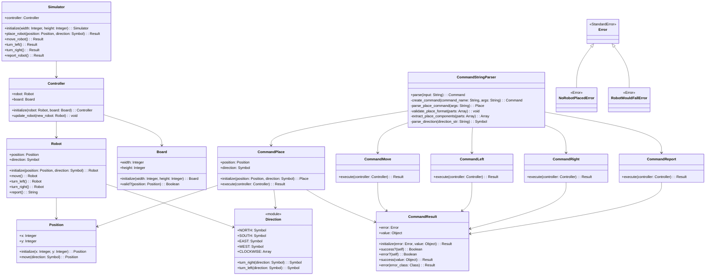

# Design Document

The system is a command-line robot simulator that controls a single robot on a 5x5 table. The system uses the Command pattern with a Result-based error handling system, maintaining immutable robot state through functional programming principles.

# Entities

## Core Domain Objects
- **Robot** - Immutable robot entity with position, direction, and movement capabilities
- **Board** - The table that defines valid positions and boundaries
- **Position** - Immutable value object representing X,Y coordinates on the board
- **Direction** - Module with constants and methods for cardinal directions (NORTH, SOUTH, EAST, WEST)

## Command System
- **Command::Place** - Concrete command to place robot at specific position and direction
- **Command::Move** - Concrete command to move robot forward one unit
- **Command::Left** - Concrete command to rotate robot counter-clockwise
- **Command::Right** - Concrete command to rotate robot clockwise
- **Command::Report** - Concrete command to output robot's current state
- **Command::Result** - Result object encapsulating success/error states
- **Command::StringParser** - Parses text input into command objects

## Control Layer
- **Controller** - Manages robot and board state, receives commands for execution
- **Simulator** - High-level facade providing convenient methods for robot operations

## Error Handling
- **Error** - Base error class
- **NoRobotPlacedError** - Error when commands are executed without a placed robot
- **RobotWouldFallError** - Error when operations would move robot outside board boundaries

## Missing CLI Infrastructure
- **CLI** - Command-line interface for processing user input (NOT YET IMPLEMENTED)
- **Application** - Main entry point that wires up dependencies (NOT YET IMPLEMENTED)

# Class Diagrams

# Key Design Decisions

## Functional Programming with Immutable Objects

The system uses immutable objects throughout, with robots and positions created as new instances rather than modified:

- **Robot** objects are immutable - move(), turn_left(), and turn_right() return new Robot instances
- **Position** objects are immutable - move() returns new Position instances
- This prevents accidental state mutation and makes the system more predictable
- Supports easier testing and reasoning about system behavior

## Result-Based Error Handling

Commands return **Command::Result** objects instead of raising exceptions:

- **Result.success(value)** for successful operations
- **Result.error(error_class)** for failures
- Enables graceful error handling without exception control flow
- Provides consistent API for all command operations
- Supports requirements for silent error handling (no error messages to stdout)

## Command Pattern with Result Objects

Each robot instruction is encapsulated as a command object that returns a Result:

- Separation of command parsing from execution
- Consistent error handling across all command types
- Easy extension for new command types
- Clean abstraction between string input and robot operations

## Layered Architecture

The system uses clear separation of concerns across layers:

- **Domain Layer**: Robot, Position, Direction, Board - core business logic
- **Command Layer**: Command objects that orchestrate domain operations
- **Control Layer**: Controller manages state, Simulator provides facade
- **Infrastructure Layer**: StringParser handles input parsing (CLI layer missing)

## Controller as State Manager

The Controller acts as a simple state holder and coordinator:

- Holds references to current robot and board instances
- Provides update_robot() method for state transitions
- Commands interact with Controller to access and modify state
- Supports the requirement that robots start unplaced (robot initially nil)

## Direction as Module with Constants

Direction is implemented as a module with symbol constants rather than a class:

- **Direction::NORTH, SOUTH, EAST, WEST** as symbols
- Module methods **turn_left()** and **turn_right()** for rotation logic
- Avoids object creation overhead for simple directional concepts
- Leverages Ruby's symbol efficiency for direction comparisons

# Missing CLI Infrastructure

The current implementation provides a complete domain model and command system but lacks the CLI interface specified in the requirements. To complete the system, the following components need to be implemented:

## Required CLI Components

### CLI Class
A command-line interface class that:
- Reads commands from standard input (stdin) line by line
- Uses StringParser to convert input strings into command objects
- Executes commands through the Controller
- Handles Result objects to determine success/failure
- Outputs only REPORT command results to stdout
- Continues processing until terminated with Ctrl-C
- Silently ignores invalid commands and errors (no error messages to stdout)

### Application Class
A main entry point that:
- Creates a 5x5 Board instance
- Creates a Controller with no initial robot (nil) and the board
- Creates a StringParser instance
- Creates a CLI instance with the controller and parser
- Starts the CLI command processing loop

### Main Executable
A bin/robot executable script that:
- Requires the robot_simulator library
- Creates and runs an Application instance
- Provides the entry point for users to run the robot simulator

## Integration Requirements

The CLI layer must handle the Result-based error handling system:
- **Result.success()** operations continue normally
- **Result.error()** operations are silently ignored (per requirements)
- Only **Command::Report** success results are output to stdout
- All error conditions (invalid placement, moves that would cause falls, commands on unplaced robots) produce no output

This design ensures the requirements are met:
- No error messages or acknowledgments for any commands except REPORT
- Silent handling of invalid commands and boundary violations  
- Continuous command processing until Ctrl-C termination
