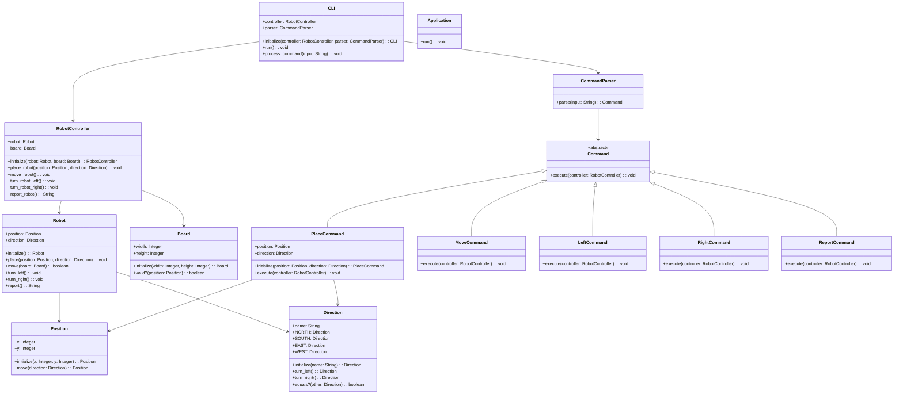

# Design Document

The system is a command-line robot simulator that controls a single robot on a 5x5 table. The system processes commands from stdin sequentially using the Command pattern, maintaining robot state internally and outputting REPORT command results to stdout.

# Entities

- Robot - The physical robot entity with position, direction, and movement capabilities
- Board - The 5x5 table that defines valid positions and boundaries
- Position - Value object representing X,Y coordinates on the board
- Direction - Value object representing one of the four cardinal directions
- Command - Abstract base for all robot commands (Command pattern)
- PlaceCommand - Concrete command to place robot at specific position and direction
- MoveCommand - Concrete command to move robot forward one unit
- LeftCommand - Concrete command to rotate robot counter-clockwise
- RightCommand - Concrete command to rotate robot clockwise
- ReportCommand - Concrete command to output robot's current state
- CommandParser - Parses text input into command objects
- RobotController - Manages robot state and executes commands (supports future multi-robot extension)
- CLI - Handles input/output and command processing loop
- Application - Main entry point that wires up dependencies

# Class Diagrams

# Key Design Decisions

## Command Pattern Implementation

The Command pattern encapsulates each robot instruction as an object, providing:

- Separation of command parsing from execution
- Easy extension for new command types
- Potential for future features like command queuing or undo functionality
- Clean abstraction between CLI input and robot operations

## Controller Abstraction

The RobotController acts as a facade managing robot operations and serves as the receiver in the Command pattern. This design:

- Centralizes robot state management and validation
- Provides a clean interface for command execution
- Enables future extension to manage multiple robots by maintaining a collection of robots
- Handles cross-cutting concerns like boundary validation and warning messages

## Robot State Management

The Robot maintains its own placed state and position/direction, with the controller coordinating operations. This ensures:

- Robot remains in consistent state across all operations
- Clear separation between robot behavior and system coordination
- Support for the requirement that unplaced robots ignore most commands
