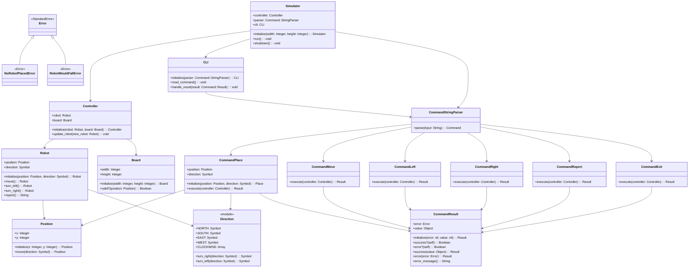

# Design Document

The system is a command-line robot simulator that controls a single robot on a 5x5 table. The system uses the Command pattern with a Result-based error handling system, maintaining immutable robot state through functional programming principles.

# Entities

- Robot - Immutable robot entity with position, direction, and movement capabilities
- Board - The table that defines valid positions and boundaries  
- Position - Immutable value object representing X,Y coordinates on the board
- Direction - Module with constants and methods for cardinal directions (NORTH, SOUTH, EAST, WEST)
- Command::Place - Concrete command to place robot at specific position and direction
- Command::Move - Concrete command to move robot forward one unit
- Command::Left - Concrete command to rotate robot counter-clockwise
- Command::Right - Concrete command to rotate robot clockwise
- Command::Report - Concrete command to output robot's current state
- Command::Exit - Concrete command to signal application termination
- Command::Result - Result object encapsulating success/error states
- Command::StringParser - Parses text input into command objects
- Controller - Manages robot and board state, receives commands for execution
- Simulator - Main application controller that manages the event loop
- CLI - Command-line interface for processing user input and output
- Error - Base error class
- NoRobotPlacedError - Error when commands are executed without a placed robot
- RobotWouldFallError - Error when operations would move robot outside board boundaries

# Class Diagrams

# Architecture

The system implements a layered architecture with clear separation of concerns:

- Domain Layer: Robot, Position, Direction, Board contain core business logic
- Command Layer: Command objects execute domain operations and return Results
- Control Layer: Controller manages state, Simulator coordinates the application
- Interface Layer: CLI handles input/output, StringParser converts text to commands

## Current Implementation Status

The system is fully implemented with a complete CLI interface. The main entry point is in lib/robot_simulator.rb which automatically runs the simulator when executed directly.

## Key Design Decisions

### Immutable Domain Objects
All domain objects (Robot, Position) are immutable and return new instances when modified, preventing accidental state mutation and supporting functional programming principles.

### Command Pattern with Result Objects
Each robot instruction is encapsulated as a command object that returns a Command::Result, enabling consistent error handling without exceptions and clean separation of parsing from execution.

### Result-Based Error Handling
Commands return Result.success(value) or Result.error(error) instead of raising exceptions, providing graceful error handling and a consistent API across all operations.

### Direction as Module
Direction is implemented as a module with symbol constants (NORTH, SOUTH, EAST, WEST) and class methods for rotation logic, avoiding object creation overhead.

### Controller as State Manager
The Controller holds references to the current robot and board, providing an update_robot() method for state transitions. Commands interact with the Controller to access and modify application state.
